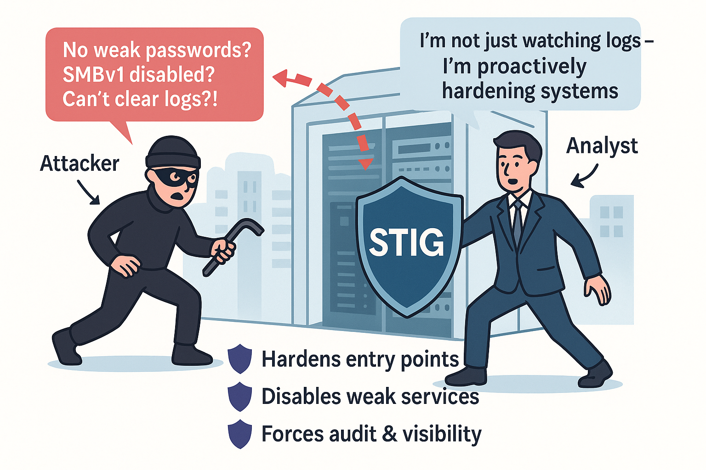

# 🛡️ STIG Hardening Framework for defending against Real World Attacks

> “STIG compliance is not just a checkbox — it's a mindset of proactive defense.”  
> — *Bharath Devulapalli, Security Analyst & STIG Automation Specialist*

---

  

<h3 align=center>🛡️ STIGs in Motion: Proactive Defense Against Real-World Attacks</h3>

## 🎯 Overview

This repository showcases practical Security Technical Implementation Guide (STIG) scripts built for both **Windows 10** and **Linux (RHEL/CentOS 7)** environments.  

Each script performs:
- ✅ **Validation** of system configuration
- 🔧 **Remediation** if non-compliant
- 🧪 **Logging** for confirmation
  
Built from hands-on lab environments using DISA STIG policies and Tenable/Nessus scans, this repo demonstrates practical hardening that aligns with MITRE ATT&CK and enterprise security needs.

---

## 🖥️ Scripts Included

| Platform | File                               | STIGs Implemented |
|----------|------------------------------------|-------------------|
| 🪟 Windows  | [windows-stigs.ps1](./source/windows-stigs.ps1) | 20 |
| 🐧 Linux    | [linux-stigs.sh](./source/linux-stigs.sh)       | 10 |

---

## ✨ STIG Compliance Matrix – What This Repo Secures

### 🪟 Windows STIGs – [📝 View Script](./source/windows-stigs.ps1)

| ✅ | STIG ID            | Configuration Enforced                           | Attack Prevented                        | MITRE ATT&CK Ref.   |
|----|--------------------|---------------------------------------------------|------------------------------------------|---------------------|
| 1  | WN10-AU-000010     | Enable Credential Validation Auditing            | Tracks valid account logins              | T1078               |
| 2  | WN10-CC-000205     | Disable Telemetry                                | Stops sensitive data exfil               | T1082               |
| 3  | WN10-CC-000025     | Disable IP Source Routing                        | Prevents spoofed network routes          | T1040               |
| 4  | WN10-CC-000005     | Disable Lock Screen Camera                       | Blocks surveillance entry vector         | T1123               |
| 5  | WN10-CC-000010     | Disable Lock Screen Slideshow                    | Avoids data leakage via screen display   | T1056               |
| 6  | WN10-CC-000360     | Disable Digest Authentication in WinRM          | Prevents credential sniffing             | T1557               |
| 7  | WN10-AU-000500     | Increase Application Log Size                    | Ensures audit trail retention            | T1070               |
| 8  | WN10-AU-000510     | Enable Security Log Retention                    | Prevents log overwrites                  | T1070.001           |
| 9  | WN10-AU-000515     | System Log Size Minimum                          | Supports forensic investigations         | T1070               |
| 10 | WN10-AU-000525     | Restrict Security Log Access                     | Stops unauthorized log reads             | T1005               |
| 11 | WN10-CC-000185     | Disable SMBv1 Protocol                           | Blocks legacy exploit pathways           | T1021.002           |
| 12 | WN10-CC-000145     | Enforce NTLMv2 Authentication                    | Prevents NTLM downgrade attacks          | T1557.001           |
| 13 | WN10-CC-000120     | Disable LM Hash Storage                          | Blocks brute force password cracking     | T1003.001           |
| 14 | WN10-CC-000095     | Disable Remote Registry Service                  | Closes remote registry abuse             | T1112               |
| 15 | WN10-CC-000070     | Disable Built-in Admin Account                   | Removes predictable admin credentials    | T1078               |
| 16 | WN10-CC-000085     | Require Ctrl+Alt+Del at Login                    | Stops spoofed login attempts             | T1056               |
| 17 | WN10-CC-000015     | Disable Autorun on All Drives                    | Blocks USB-based malware auto exec       | T1091               |
| 18 | WN10-CC-000045     | Disable Control Panel Access                     | Prevents misconfig by users              | T1546               |
| 19 | WN10-CC-000140     | Disable Anonymous SID Enumeration                | Restricts attacker enumeration           | T1087               |
| 20 | WN10-CC-000200     | Disable NetBIOS over TCP/IP                      | Prevents legacy net exposure             | T1016               |

---

### 🐧 Linux STIGs – [📝 View Script](./source/linux-stigs.sh)

| ✅ | STIG ID            | Configuration Enforced                           | Attack Prevented                        | MITRE ATT&CK Ref.   |
|----|--------------------|---------------------------------------------------|------------------------------------------|---------------------|
| 1  | RHEL-07-040370     | Disable SSH Root Login                           | Blocks privileged remote brute force     | T1021.004           |
| 2  | RHEL-07-040340     | SSH Protocol 2 Only                              | Stops downgrade/MITM vulnerabilities     | T1021.004           |
| 3  | RHEL-07-010250     | Set Password Max Age (60 Days)                   | Prevents long-term credential abuse      | T1110               |
| 4  | RHEL-07-010280     | Set Password Min Length (12 Chars)               | Makes brute-forcing harder               | T1110               |
| 5  | RHEL-07-010375     | Lock User After 3 Failed Logins                  | Stops credential spraying                | T1110               |
| 6  | RHEL-07-020230     | Disable Ctrl+Alt+Del Reboot                      | Prevents local denial-of-service         | T1490               |
| 7  | RHEL-07-030000     | Ensure auditd is Running                         | Enables full system monitoring           | T1562               |
| 8  | RHEL-07-020100     | Secure /tmp with noexec,nosuid,nodev             | Prevents malware staging/exec            | T1055               |
| 9  | RHEL-07-010240     | Set Password Min Age (7 Days)                    | Blocks password reuse looping            | T1078               |
| 10 | RHEL-07-020230     | Enforce Time Sync with chronyd                  | Ensures accurate forensic timestamps     | T1070.006           |

---

## 🧠 Why This Repo Matters

| Feature                      | Value Delivered                                                        |
|------------------------------|-------------------------------------------------------------------------|
| ✅ Real-World Hardening       | Based on actual Tenable/Nessus STIG scans                              |
| 🧪 Validated Configurations   | Every script includes self-checks before/after applying changes        |
| 📊 Audit-Ready Output         | Ideal for GRC roles and compliance demonstrations                      |
| 🎓 Resume Power               | Shows deep hands-on work across platforms and security layers          |
| 🧱 MITRE ATT&CK Alignment     | Maps each config to adversary behavior techniques                      |

---

## 👨‍💻 Author

**Bharath Devulapalli (VBDev)**  
Cybersecurity Analyst | SOC | STIG Automation | GRC & Detection  
🔗 [LinkedIn](https://www.linkedin.com/in/venkatadevu) | 💻 [GitHub](https://github.com/bharathkasyap)

---

## 📜 License

MIT License – Use, fork, and build upon with proper credit.

---

## 🔗 References

- [DISA STIG Viewer](https://public.cyber.mil/stigs/)
- [Microsoft Security Baselines](https://learn.microsoft.com/en-us/windows/security/)
- [SCAP Security Guide for Linux](https://github.com/ComplianceAsCode/content)
